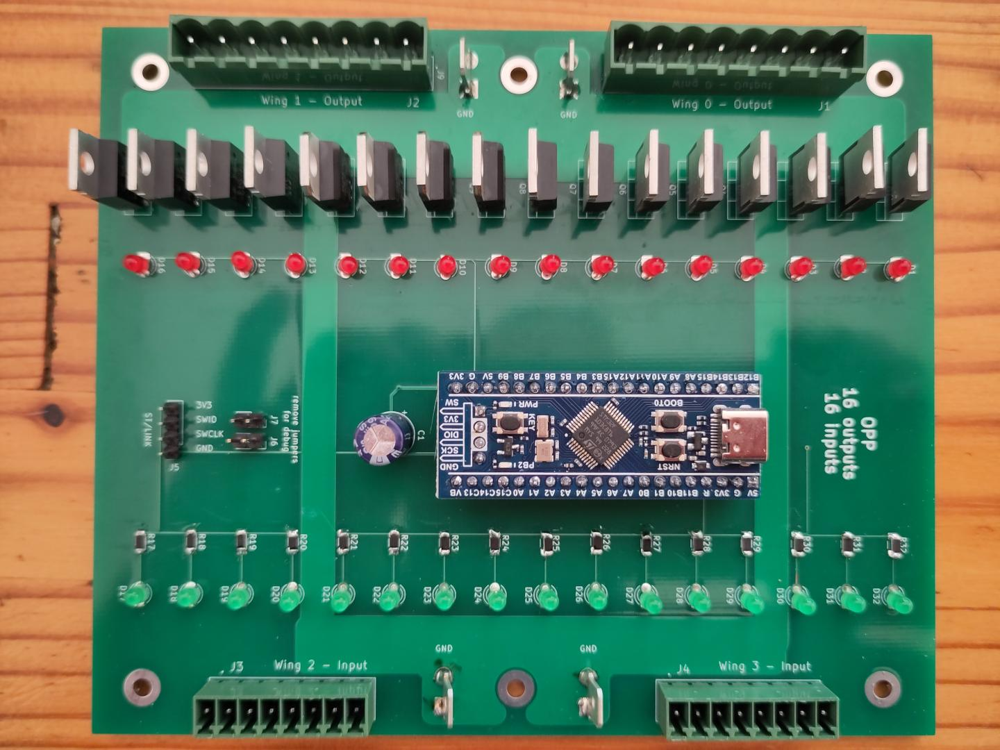
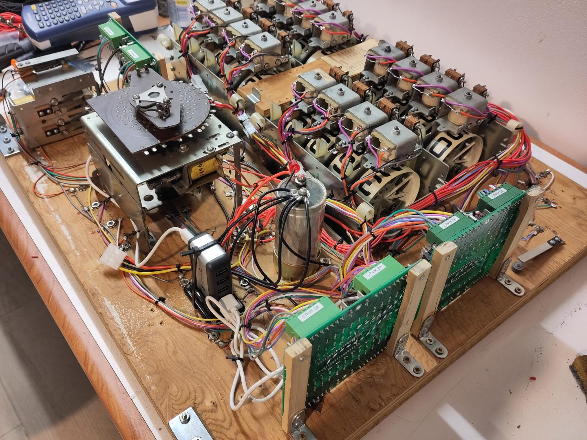
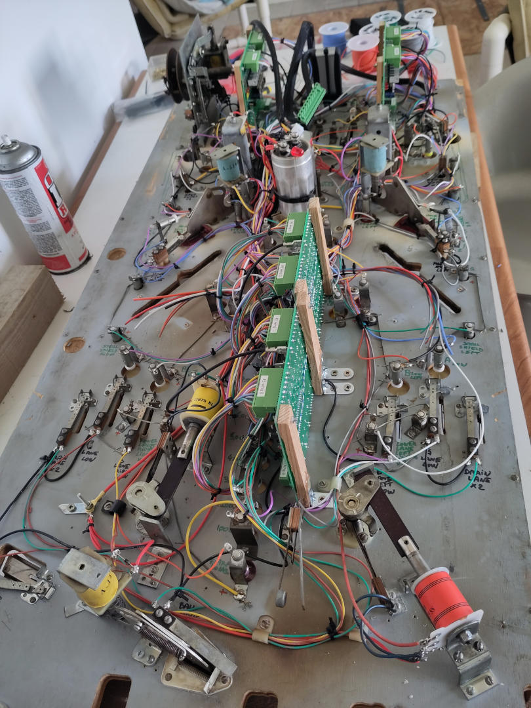
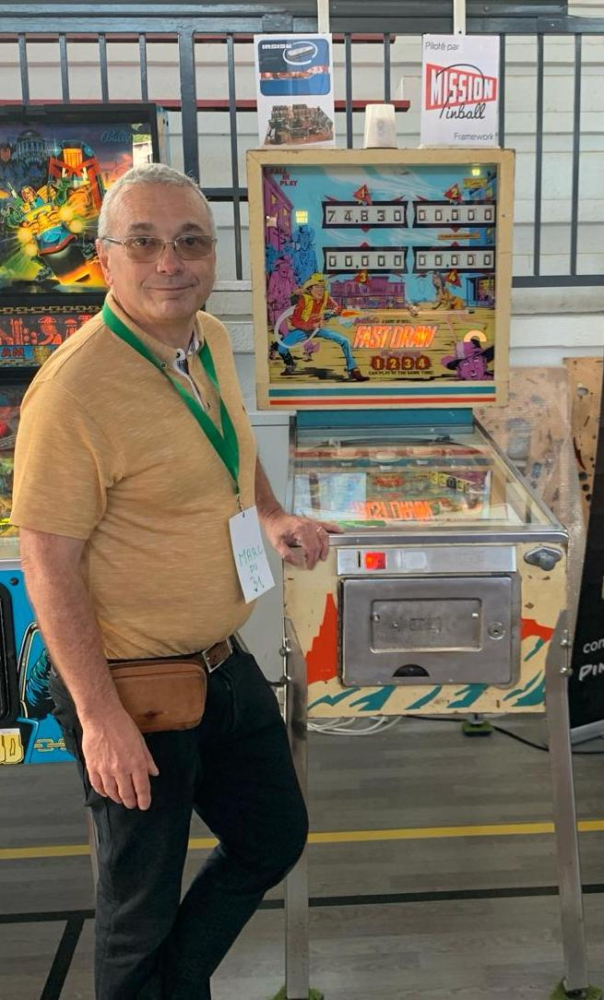

# OPP EM Combo boards

--8<-- "hardware_platform.md"





The aim of this project is to provide cheap hardware to control EM pinball machines:

* `O16I16`: 16 soldenoid / incandescent outputs and 16 inputs combo card
* `O32`: 32 outputs soldenoid / incandescent combo card

Firmware is currently a fork of [open-pinball-project](https://sourceforge.net/projects/open-pinball-project/) at version 2.4.0.0, [hosted at gitlab](https://gitlab.com/mrechte/open-pinball-project).

A single BluePill MCU may control up to 32 GPIO lines, logically divided in 4 wings of 8 lines each.

A wing is usually specialized (switch inputs, solenoids, lamps, ...) according to the hardware attached.

This version focuses on the [blue pill plus](https://github.com/WeActStudio/BluePill-Plus) which has the advantage
of having a blue LED on PB2 which is not used by card headers. It also features an USBC-C connector.

The size of the board is about 150 x 125 mm.

Several boards are required to drive an EM machine. 
According to the complexity and your personal taste, 3-4 to drive the play field, 2-3 to drive the light box.





## Configuration

A typical configuration will use the card serial number to identify the boeard, not the port name which may change after host reboot.
In this example, coil `c_player1_reel10` has number `0-0-0` meaning:

`0-?-?`: driven by card id #0

`?-0-?`: always 0 (1 usb port only drives one MCU)

`?-?-0`: first output (that is wing 0, pin 0)

Coil `c_player1_reel100` is driven by the same card, second output (that is wing 0, pin 1)


``` yaml
#config_version=6

hardware:
  platform: opp
  driverboards: gen2

opp:
    ports: /dev/ttyACM0, /dev/ttyACM1,/dev/ttyACM2, /dev/ttyACM3, /dev/ttyACM4, /dev/ttyACM5, /dev/ttyACM6

coils:
  # Board LB_1_16O16, id #0
  c_player1_reel10:
    number: 0-0-0
    default_pulse_ms: 7
  c_player1_reel100:
    number: 0-0-1
    default_pulse_ms: 7

```

To set the card serial number and configure the wings, one will have to read the [interface manual](https://gitlab.com/mrechte/open-pinball-project/-/blob/master/doc/brdIntf.fodt)
and use a PC with [gen2test.py](https://gitlab.com/mrechte/open-pinball-project/-/tree/master/firmware/tools) utility.

In the above example one would do:

```
./gen2test.py --serial 0
./gen2test.py --config opp16o16icfg.py
./gen2test.py --save
```

## My project

With those boards, I digitized a 1975 Gottlieb Fast Draw, which was presented to the [Pontacq Pinball Show](https://www.facebook.com/groups/154388563388625)
on June 1rst-2nd, 2024, South of France, where it ran 375 plays without any software problem.




